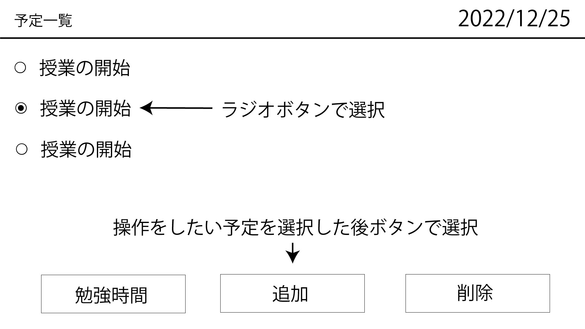
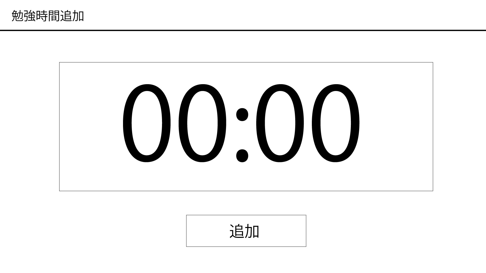

# オブジェクト指向プログラミングおよび演習 第12回進捗レポート

## 作成者情報

- 学籍番号：K22135
- 氏名：村山颯真
- グループ：9
  - メンバー
    - K22065 柴田悠仁（チームリーダー）
    - K22083 竹本弥生
    - K22112 藤田勇輝
    - K22054 後藤啓輔 
    - K21069 杉山怜央
    - K22064 柴田翔空
    - K22144 横井聡

## 仕様

flaskを使ったカレンダーアプリ兼学習時間記録アプリ
予定を削除できる
予定の一覧が見れる
勉強時間の記録できる
CSSで画面を見やすくする
他の機能は随時追加

## アプリ完成イメージ

- トップページのイメージ
 

- 予定一覧のイメージ
 

- 予定の追加のイメージ
 

- 勉強時間追加のイメージ
 

## 作業分担

▫️リーダー
pull requestの認証、適宜サポート、発表資料の作成（担当：K22065 柴田悠仁）
▫️Web担当
- カレンダーの作成：Html、Css、JavaSJavaScriptでのカレンダー作成（担当：K22144 横井聡）
- カレンダーの表示：JsonJsonファイルからの予定の表示（担当：K22112 藤田勇輝 ）
- 一覧ページの実装：Html,Html,追加ページへの移動（担当：K22083 竹本弥生）
- 予定の追加ページの実装：Html,Html,追加ボタンが押された時の処理（担当：K21069 杉山怜央）
▫️Python担当
- 予定の追加実装：予定一覧に予定を追加する（担当：K22064 柴田翔空）
- 予定の消去：予定一覧から予定を消去する（担当：K22054 後藤啓輔）
- 追加機能の実施：勉強時間の記録（担当：K22135 村山颯真）

## 作業報告

- study.pyを後藤啓輔と作成しプルリクエストを送った
  - プルリクエストがマージされた

## グループ内でお世話になった人2〜3名を理由とともに挙げる

- 勉強時間を記録する機能を実装するときに手伝ってくれた (K22054 後藤啓輔 )
- 作成するGUIアプリを決める会議でそれぞれの人の意見をまとめてくれた (K22144 横井聡)

## 振り返り（感想含む）と次回までの作業予定

-　思っていたより作業の進みが遅かった
-　来週は実際に保存することができるか確かめる