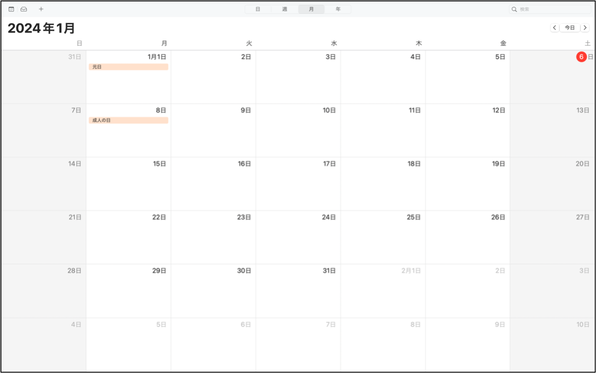
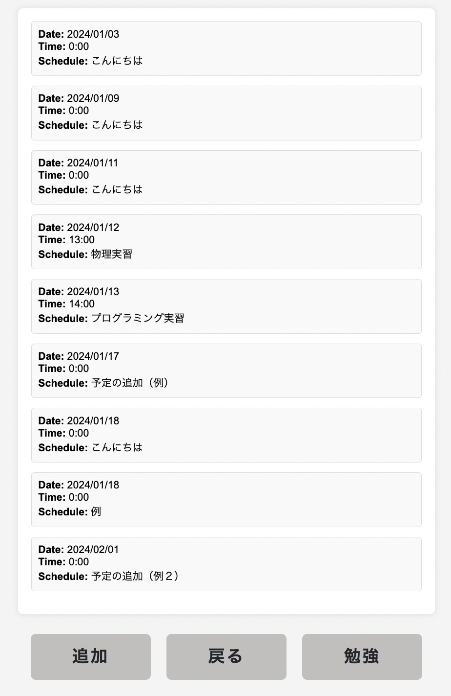

# オブジェクト指向プログラミングおよび演習 第13回進捗レポート

## 作成者情報

- 学籍番号：K22135
- 氏名：村山颯真
- グループ：9
  - メンバー
   - K22065 柴田悠仁（チームリーダー）
   - K22083 竹本弥生
   - K22112 藤田勇輝    
   - K22054 後藤啓輔
   - K21069 杉山怜央
   - K22064 柴田翔空
   - K22144 横井聡

## 仕様

- flaskを使ったカレンダーアプリ兼学習時間記録アプリ
- 予定を追加できる
- 予定を削除できる
- 予定の一覧が見れる
- 勉強時間の記録できる
- 勉強時間の時間配分を円グラフで見ることができる
- CSSで画面を見やすくする
- 他の機能は随時追加

## アプリ完成イメージ

- トップページのイメージ
 

- 予定一覧のイメージ
 

- 予定の追加のイメージ
 

- 勉強時間追加のイメージ
 

## 現在の完成画面
- トップページのイメージ
 

- 予定一覧のイメージ
 

- 予定の追加のイメージ
 

- 勉強時間追加のイメージ
 

## 作業分担(1/18まで)

▫️リーダー
- pull requestの認証、適宜サポート、発表資料の作成（担当：K22065 柴田悠仁）
  
▫️Web担当
- カレンダーの作成：Html、Css、JavaSJavaScriptでのカレンダー作成（担当：K22144 横井聡）
- カレンダーの表示：Jsonファイルからの予定の表示（担当：K22112 藤田勇輝 ）
- 一覧ページの実装：Html,追加ページへの移動（担当：K22083 竹本弥生）
- 予定の追加ページの実装：Html,追加ボタンが押された時の処理（担当：K21069 杉山怜央）
  
▫️Python担当
- 予定の追加実装：予定一覧に予定を追加する（担当：K22064 柴田翔空）
- 予定の消去：予定一覧から予定を消去する（担当：K22054 後藤啓輔）
- 追加機能の実施：勉強時間の記録（担当：K22135 村山颯真）

## 作業分担(1/19から)

▫️リーダー
- pull requestの認証、適宜サポート、発表資料の作成（担当：K22065 柴田悠仁）
  
▫️Web担当
- カレンダーの表示：今日の場所に色をつける、カレンダーを見やすくする（担当：K22144 横井聡）
- カレンダーの表示：Jsonファイルからの予定の表示（担当：K22112 藤田勇輝 ）
- 一覧ページの実装：予定を日付、件名などで検索できるようにする（担当：K22083 竹本弥生）
- 勉強ページの実装：勉強時間の追加フォームの作成、円グラフの表示（担当：K21069 杉山怜央）
  
▫️Python担当
- jsonの読み込み・web補助：jsonファイルの読み込み（担当：K22064 柴田翔空）
- 予定の消去・web補助：jsonファイルの読み込み（担当：K22054 後藤啓輔）
- 勉強ページの実装：勉強時間を記録したjsonファイルを読み込んで円グラフに出す（担当：K22135 村山颯真）

## 作業報告（個人でお願いします）

- main.py内のdef address_get()を参考にし勉強時間を入力できるようmain.py, study.pyを変更した
  -pushした　

## グループ内でお世話になった人2〜3名を理由とともに挙げる（個人でお願いします）

- 進捗を報告するための会議の場を設けてくれた(K22065 柴田悠仁)
- jsonファイルを読み込む方法を考えてくれた（K22064 柴田翔空）

## 振り返り（感想含む）と次回までの作業予定（個人でお願いします）

- 
- 